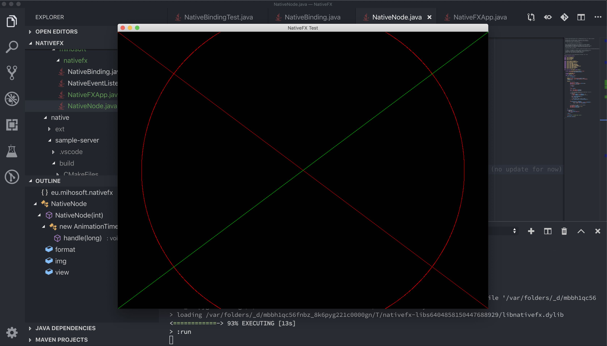

# NativeFX (WIP)

 

Native Rendering integration for JavaFX (13 and beyond)

## Why?
NativeFX adds native rendering support to the JavaFX scene graph. It uses [Boost IPC](https://www.boost.org/doc/libs/1_63_0/doc/html/interprocess.html) to share memory among multiple processes. In contrast to other solutions it runs with the official APIs. No workarounds necessary. And since the native rendering is done in a seperate process it won't crash your JVM if something goes wrong. That's ideal if you are interesed in a robust solution.

Why should you use it? Ever wanted to integrate native applications into the scene graph? Maybe you want to add OpenGL support, a Qt application or Blink/WebKit. All of this will be possible with NativeFX!

## WIP

Got curious? This project is still WIP. But it comes with a sample server that shows how to use it. We run it on Linux, macOS and Windows (on x64). There's a good chance it will work for you as well. If not, create an issue and let us know!

Many features are still missing. But this project is already compatible with JDK13 and JavaFX 13.

## Performance

There have been efforts to do this before. Why should this approach be any better? 

Good question! We started with a direct buffer and used the PixelWriter interface to update a WritableImage that displays the content. With JavaFX 13 we added support for the new PixelBuffer API. Early tests show that we can expect a performance boost of around 50%. For our use cases this is a game changer!

If you are willing to use internal APIs you can try [DriftFX](https://github.com/eclipse-efx/efxclipse-drift). Which will work with direct texture sharing instead of slow CPU based buffers. NativeFX is a more conservative approach.

## Building NativeFX

### Requirements

- Java >= 11
- C++11 compliant compiler (GCC, Clang, Visual Studio 2017-19)
- CMake >= 3.9
- Internet connection (dependencies are downloaded automatically)
- IDE: [Gradle](http://www.gradle.org/) Plugin (not necessary for command line usage)

### IDE

Open the `NativeFX` [Gradle](http://www.gradle.org/) project in your favourite IDE (tested with VSCode) and build it
by calling following tasks `clean assemble`.

### Command Line

Navigate to the `NativeFX` [Gradle](http://www.gradle.org/) project (i.e., `path/to/NativeFX/`) and enter the following command

#### Bash (Linux/macOS/Cygwin/other Unix shell)

    bash gradlew clean assemble
    
#### Windows (CMD)

    gradlew clean assemble

On Windows, make sure the environment is configured for development (MSBuild.exe must be on the path).

## Testing NativeFX

### Step 1 (compile and run the sample-server)

To compile and run the sample-server, do the following (relative to the previous project folder):

#### Bash (Linux/macOS/Cygwin/other Unix shell)

    cd sample-servers/sample-server/
    mkdir build
    cd build
    cmake ..
    make
    ./sample-server -n _mem_1
    
#### Windows (CMD)

    cd sample-servers/sample-server/
    mkdir build
    cd build
    cmake .. -DCMAKE_GENERATOR_PLATFORM=x64
    MSBuild.exe sample-server.sln /property:Configuration=Release /property:Platform=x64
    Release\x64\sample-server.exe -n _mem_1
    
If the last command doesn't work, then check whether the executable is located in `Release\sample-server.exe` without `x64`.    

### Step 2 (run the sample JavaFX application)

Navigate back to the NativeFX project folder (i.e., `path/to/NativeFX/`) and do the following:

#### Bash (Linux/macOS/Cygwin/other Unix shell)

    bash gradlew run
    
#### Windows (CMD)

    gradlew run
    
Now, click the Connect button.    
    
That's it!

## Testing the Qt sample server:

### Requirements

- Qt 5.x (tested with 5.12 and 5.13.1)
- Internet connection

### Step 1 (compile and run the sample-server)

Make sure Qt is installed properly (libs must be on the PATH). To compile and run the sample-server, do the following (relative to the previous project folder):

#### Bash (Linux/macOS/Cygwin/other Unix shell)

    cd sample-servers/nativefx-qt/
    mkdir build
    cd build
    cmake ..
    make
    ./nativefx-qt -n _mem_1
  
#### Windows (CMD)

    cd sample-servers/nativefx-qt/
    mkdir build
    cd build
    cmake .. -DCMAKE_GENERATOR_PLATFORM=x64
    MSBuild.exe nativefx-qt.sln, /property:Configuration=Release /property:Platform=x64
    Release\nativefx-qt.exe -n _mem_1
    
If Qt5 cannot be found, let CMake know where to search for Qt, e.g.,

    cmake .. -DCMAKE_GENERATOR_PLATFORM=x64 -DQt5_DIR=C:\Qt\5.13.1\msvc2017_64\lib\cmake\Qt5\

Hint: Qt5_Dir has to point to a directory containing 'Qt5Config.cmake' or 'qt5-config.cmake'.
    
If the last command doesn't work, then check whether the executable is located in `Release\nativefx-qt.exe` without `x64`.     
    
### Step 2 (run the sample JavaFX application)

Navigate back to the NativeFX project folder (i.e., `path/to/NativeFX/`) and do the following:

#### Bash (Linux/macOS/Cygwin/other Unix shell)

    bash gradlew run
    
#### Windows (CMD)

    gradlew run
    
Now, click the Connect button. 
